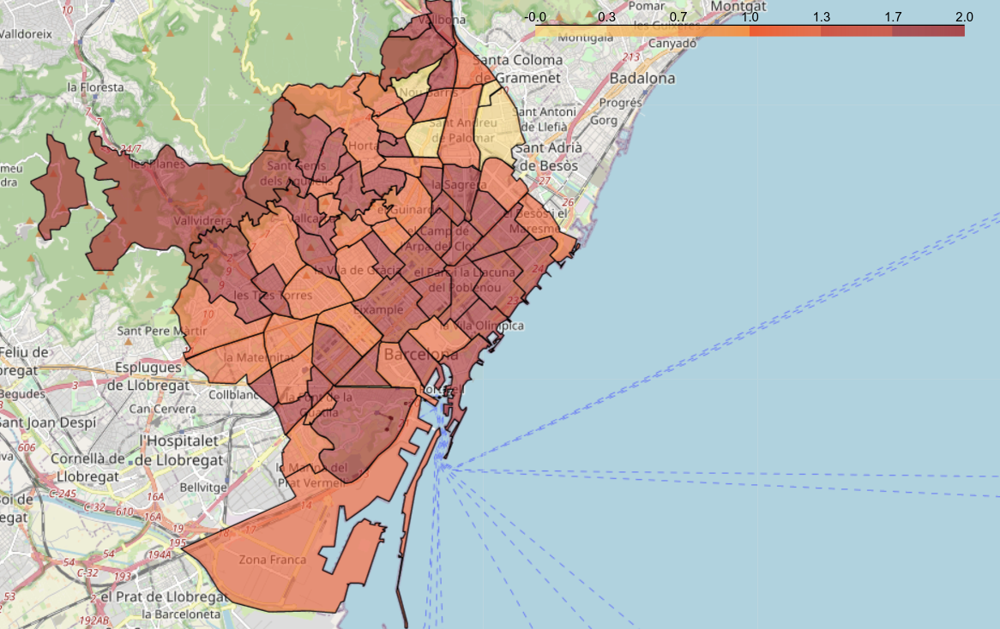

# COVID-19 ERTEs Impact Visualization in Barcelona

Due to the Coronavirus disease (COVID-19) outbreak situation that the world has been suffering for the last months, on March 14, 2020, <cite>[the Spanish government declared the so-called _Estado de Alarma_][1]</cite>, imposing restrictions on the mobility of the population and the economic activity of different sectors, in order to control the spread of the virus across the country. 

These measures have had, unfortunately, a big impact on the economy and employment. Companies and employers are losing <cite>[thousands of millions of Euros][2]</cite> and, as a consequence, many of them have had to drastically reduce their number of employees via a procedure called <cite>[_Expediente de Regulación Temporal de Empleo_][3]</cite>, or _ERTE_ for short, which allows companies and business to temporarily fire one or more employees, during the time their economic activity is suspended.

We are interested in visualizing the impact of such ERTEs from a geographical point of view in the Spanish city of _Barcelona_, which is one of the most important ones from an economic point of view. In particular, we have examined and classified the different types of venues, shops and services of each of the neighborhoods of the city, and used data of the ERTEs in Catalonia in order classify neighborhoods in terms of the impact these ERTEs have had on each of them. After all the analysis, have produced a map of Barcelona that allows visualizing the results.  

You can find a complete explanation of the project in the file _report.pdf_. The folder _Notebook_ contains a Jupyter Notebook with all the coding. 

[1]: https://www.boe.es/diario_boe/txt.php?id=BOE-A-2020-3692
[2]: https://www.abc.es/economia/abci-economia-tras-covid-19-hundimientos-y-empleo-rapida-recuperacion-y-cambios-consumo-202004070159_noticia.html
[3]: https://www.lavanguardia.com/economia/20200320/474272215730/erte-empleo-paro-derechos-trabajador-que-es-cobrar-seguridad-social.html